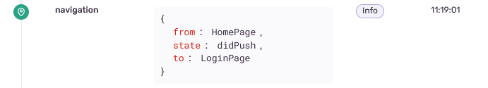

# named_routes

This opinionated package provides extension methods for `BuildContext` to push routes.

...and automatically add a name to the route so you can track it in sentry!

## Motivation

I don't like to manually declare all routes and just push a widget and that's it!

The problems:

1) Pushing a new route requires lots of boilerplate.
2) I want to add some name to the route in order to track it in sentry.

```dart
Navigator.push<T>(
  context,
  MaterialPageRoute(
    builder: (_) => LoginPage(),
    settings: RouteSettings(name: 'LoginPage'), // so redundant!
  ),
);
```

## Usage

Pushing a route:

```dart
// push a new route
context.push(() => MyPage());

// push a route while removing all others
context.pushRoot(() => MyPage());

// push a route while removing all others (without animation)
context.pushRootNoAnimation(() => MyPage());
```

## Sentry

You want it to look like this?



```dart
MaterialApp(
  navigatorObservers: [
    SentryNavigatorObserver(), // add this 
  ],
  home: const InitPage(),
);
```
